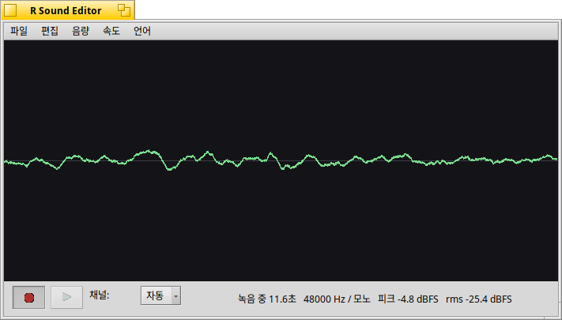

# R Sound Editor

Haiku OS용 녹음기 겸 간단한 파형 편집기입니다.

[English](README.md)



Haiku OS 기본 SoundRecorder는 녹음이 끝난 `BMediaTrack`을 읽어 파형을 그리기 때문에, 녹음을 멈춰야 비로소 파형이 나타납니다. 녹음 도중에는 마이크가 소리를 잡고 있는지조차 알 수 없습니다. 

이 앱은 캡처 콜백이 락 없는 링 버퍼를 채우고 렌더 스레드가 그것을 비우는 구조라, 녹음 중에 파형이 실시간으로 흘러갑니다.
녹음을 멈추면 같은 화면이 전체 녹음을 보여주고, 드래그해서 편집할 구간을 선택할 수 있습니다.

녹음 내용은 메모리에 float 프레임으로 보관하며, 모든 편집(잘라내기, 게인, 속도)이 무손실입니다.

## 기능

- 녹음 중 실시간으로 흐르는 파형
- 모노 / 스테레오, 또는 **자동** — 처음 0.5초를 들어보고 실제 입력에 맞춰 결정합니다
- 재생 시간(경과/전체) 표시와 그에 맞춰 움직이는 재생 위치 막대
- 파형을 드래그해 구간 선택 후 삭제, 그 구간만 남기기, 무음화
  (Delete 또는 Backspace 키로 선택 구간 삭제)
- 음량 ±3 dB, 정규화
- 속도 ×1.25 / ×0.8 (문서 자체를 리샘플링하므로 저장한 파일에도 반영됩니다)
- 파일 대화상자를 통한 WAV 저장
- 한국어/영어 UI. **언어** 메뉴에서 실행 중에 전환할 수 있고, 처음에는 시스템 언어를 따릅니다

## 요구 사항

Haiku OS (x86 또는 x86_64). 크로스 컴파일러가 필요 없으니 실행할 기기에서 그대로 빌드하시면 됩니다.

## 빌드 및 설치

Haiku OS 기기에서:

```sh
./install.sh
./install.sh --build-only   # 빌드만 하고 설치하지 않음
./install.sh --uninstall    # 제거
```

`install.sh`는 `~/config/non-packaged/apps`에 바이너리를 설치하고, **Deskbar -> Applications** 메뉴와 **바탕화면** 양쪽에 링크를 만듭니다.

## 라이선스

MIT

## AI 기여 고지

이 프로그램은 Claude와 함께 작업해 만들었습니다.
