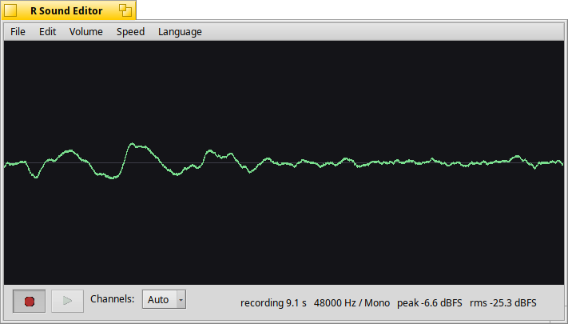

# R Sound Editor

A recorder and small waveform editor for Haiku OS.

[한국어](README.ko.md)



Haiku OS's stock SoundRecorder renders its scope from a finished `BMediaTrack`, so the waveform only appears once you stop recording — you cannot see whether the microphone is picking anything up while a take is running. Here the capture callback fills a lock-free ring that a render thread drains, so the trace scrolls live; once stopped, the same view shows the whole take and can be dragged to select a region to edit.

The recording is held in memory as float frames, so every edit (cut, gain, speed) is lossless until the WAV is written.

## Features

- Live scrolling waveform while recording
- Mono / stereo, or **Auto** — listens for the first 0.5 s and commits to whichever the input actually is
- Playback with elapsed/total time and a playhead that tracks it
- Drag on the waveform to select a region; delete, trim to, or silence it
  (Delete or Backspace removes the selection)
- Volume ±3 dB, normalize
- Speed ×1.25 / ×0.8 (resamples the document, so the change survives export)
- Save as WAV through a file panel
- English and Korean UI, switchable at runtime from the **Language** menu; starts in the system language

## Requirements

Haiku OS (x86 or x86_64). Nothing here needs a cross-compiler — build it on the machine you are going to run it on.

## Build and install

On the Haiku machine:

```sh
./install.sh
./install.sh --build-only   # compile in place, install nothing
./install.sh --uninstall    # remove it again
```

`install.sh` puts the binary in `~/config/non-packaged/apps` and links it into both **Deskbar -> Applications** and the **Desktop**.

## License

MIT.

## AI Disclaimer

This application was produced by a human working with Claude.
